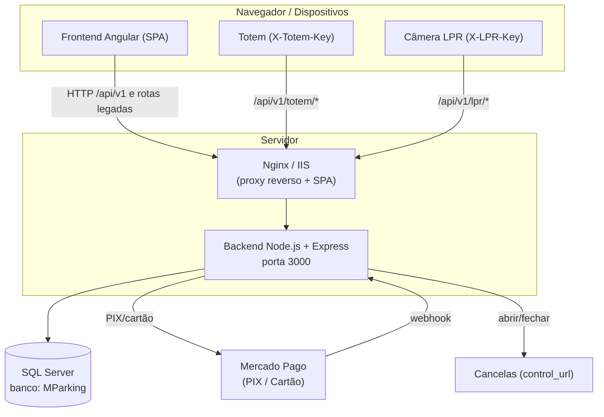
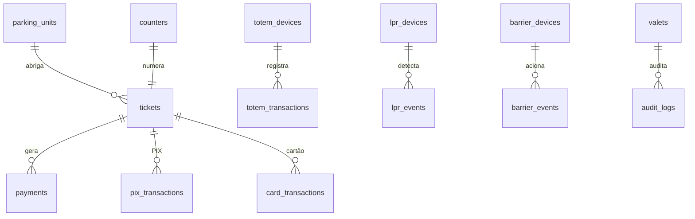
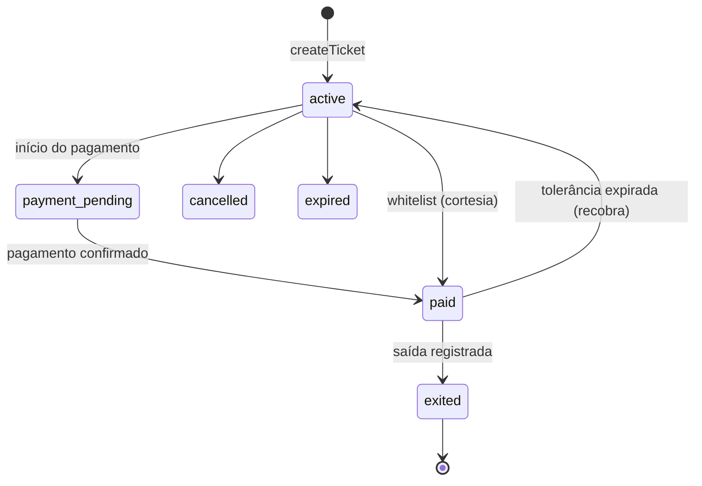
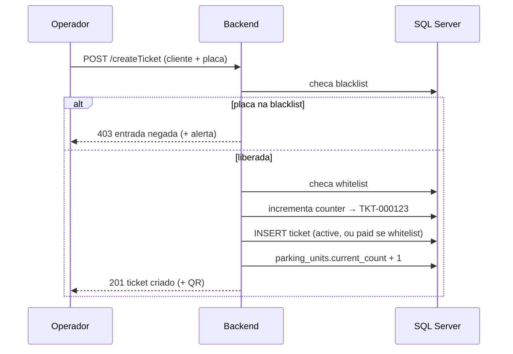
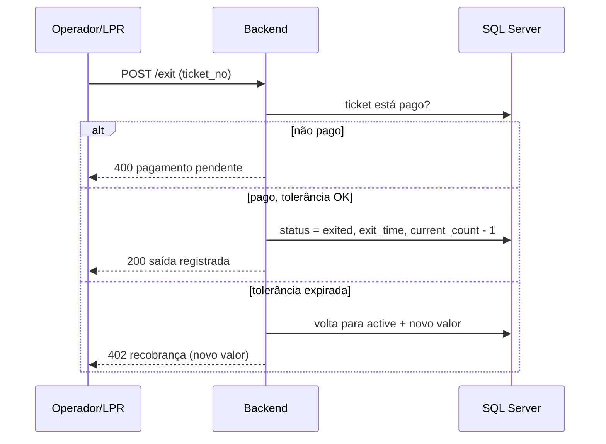

# 📘 Documentação Final — Janus Parking

> **Sistema de gestão de estacionamento / valet** com tickets eletrônicos, pagamento (presencial, PIX e cartão), totem de autoatendimento, reconhecimento de placas (LPR) e controle de cancelas.
>
> **Identificador técnico no código-fonte:** `2M Parking` (versão da API: **v2.3.0**). O nome comercial adotado nesta documentação é **Janus Parking**. Todos os nomes técnicos (banco `MParking`, pastas, variáveis) permanecem como estão no código.

---

## 📑 Índice

1. [Visão Geral](#1-visão-geral)
2. [Arquitetura](#2-arquitetura)
3. [Backend (API)](#3-backend-api)
4. [Banco de Dados — onde os dados ficam](#4-banco-de-dados--onde-os-dados-ficam)
5. [Frontend (Angular)](#5-frontend-angular)
6. [Fluxos de Negócio](#6-fluxos-de-negócio)
7. [Regras de Tarifação](#7-regras-de-tarifação)
8. [Configuração e Variáveis de Ambiente](#8-configuração-e-variáveis-de-ambiente)
9. [Build, Deploy e Operação](#9-build-deploy-e-operação)
10. [Mapa de Arquivos — onde encontrar cada coisa](#10-mapa-de-arquivos--onde-encontrar-cada-coisa)
11. [Segurança](#11-segurança)
12. [Pendências e Divergências](#12-pendências-e-divergências)

---

## 1. Visão Geral

O **Janus Parking** automatiza a operação de um estacionamento: registro de entrada de veículos, emissão de ticket eletrônico, cobrança por tempo de permanência, pagamento por múltiplos meios e registro de saída — com suporte opcional a **totens de autoatendimento**, **câmeras de leitura de placa (LPR)** e **cancelas automáticas**.

### Stack tecnológica

| Camada | Tecnologia |
|---|---|
| **Frontend** | Angular 7 (TypeScript), SCSS, `angularx-qrcode`, `ngx-spinner` |
| **Backend** | Node.js 20 + Express 4 |
| **Banco de dados** | Microsoft SQL Server (driver `mssql`) |
| **Autenticação** | JWT (`jsonwebtoken`) + `bcryptjs` |
| **Pagamentos** | Mercado Pago (PIX e cartão) — com modo *sandbox mock* embutido |
| **Segurança HTTP** | `helmet`, `cors`, `express-rate-limit`, `compression` |
| **Servidor web / proxy** | Nginx (Docker) ou IIS (Windows) |
| **Processo** | PM2 (Windows) ou Supervisor (Docker) |
| **Containerização** | Docker multi-stage + Docker Compose |

### Perfis de usuário (papéis)

| Papel | Descrição | Token (localStorage) |
|---|---|---|
| `admin` | Acesso total: gestão, relatórios, dispositivos, configurações | `token_v` |
| `operador` | Cria tickets, registra pagamento e saída | `token_v` |
| `fiscal` | Consulta (placas, ocupação) — sem alterar | `token_v` |
| `user` (cliente) | Vê o próprio ticket e paga | `token` |

### Glossário

- **Ticket** — registro de uma estadia (`TKT-000001`, `TKT-000002`, …). Equivale a uma "sessão" de estacionamento.
- **Totem / Paystation** — quiosque de autoatendimento autenticado por API key (`X-Totem-Key`).
- **LPR** (*License Plate Recognition*) — câmera que detecta placas, autenticada por `X-LPR-Key`.
- **Cancela** (*barrier*) — porteira/barreira de entrada ou saída.
- **Whitelist** — placas isentas (entram já como "pagas"/cortesia).
- **Blacklist** — placas bloqueadas (entrada negada).
- **Grace period** — tolerância em minutos para sair após o pagamento.

---

## 2. Arquitetura



### Como as partes se conectam

- O **frontend** (Angular) é compilado para arquivos estáticos e servido pelo **Nginx** (em Docker) ou **IIS** (em Windows).
- Toda chamada de API passa pelo proxy reverso, que encaminha `/api/v1/*` e as rotas legadas para o **backend Node** na porta `3000`.
- O **backend** concentra toda a lógica e é a única camada que fala com o **SQL Server**.
- Pagamentos online (PIX/cartão) usam o **Mercado Pago**; quando não há credencial configurada, o sistema opera em **modo sandbox mock** (simulação).
- O backend ainda dispara comandos para **cancelas** físicas (quando configurado `control_url`) e recebe eventos de **câmeras LPR**.

### Duas "linguagens" de API

O backend expõe os mesmos recursos em dois formatos, por compatibilidade:

1. **Rotas legadas** — ex.: `POST /authorizeValet`, `POST /createTicket`, `GET /user`.
2. **API versionada** — ex.: `POST /api/v1/entry`, `GET /api/v1/session/:plate`, `POST /api/v1/payment`, além das rotas nativas de totem, PIX, cartão, LPR e cancela sob `/api/v1/*`.

A API versionada em grande parte **reescreve a requisição** e a repassa internamente para a rota legada equivalente (ver [seção 3](#3-backend-api)).

---

## 3. Backend (API)

**Arquivo único:** [valetv2/functions/index.js](../functions/index.js) (~3.450 linhas). Versão `APP_VERSION = "2.3.0"`.

### 3.1 Inicialização e infraestrutura interna

| Recurso | Como funciona |
|---|---|
| **Validação de ambiente** | Em produção, aborta se faltar `DB_PASSWORD`, `JWT_SECRET` ou `SETUP_KEY`. |
| **Logging estruturado** | Função `log(level, msg, meta)` com níveis `ERROR/WARN/INFO/DEBUG` (via `LOG_LEVEL`); `requestLogger` registra método, URL, status, duração e IP. |
| **Pool SQL com auto-reconexão** | `getPool()` reconecta com *backoff* exponencial (até 5 tentativas, máx. 8s) e dispara alerta `system_error` em falha. |
| **Cache em memória com TTL** | Objeto `cache` (Map) para tarifação, flags de configuração, whitelist/blacklist etc. |
| **Jobs periódicos** | `cleanupOldTickets` (diário — remove tickets `exited/cancelled/expired` mais antigos que `ticket_retention_days`, padrão 90) e `checkDevicesOffline` (a cada 5 min — alerta `device_offline`). |
| **Graceful shutdown** | `SIGTERM`/`SIGINT` fecham servidor e pool; força saída após 10s. |
| **HTTP/HTTPS dual** | Se `HTTPS_ENABLED=true`, sobe HTTPS com `HTTPS_KEY`/`HTTPS_CERT`; senão, HTTP. |

### 3.2 Segurança e middlewares

- **CORS** restrito às origens de `CORS_ORIGINS` (cabeçalhos permitidos incluem `Authorization`, `X-Totem-Key`).
- **Helmet** + cabeçalhos extras em produção (`X-Content-Type-Options`, `X-Frame-Options: DENY`, `Referrer-Policy`, `Permissions-Policy`, HSTS).
- **Rate limiting** (por IP, exceto onde indicado):

| Limiter | Janela | Limite | Aplicado a |
|---|---|---|---|
| `generalLimiter` | 15 min | 200 | Tudo (exceto `/health` e `/api/v1/totem/*`) |
| `loginLimiter` | 15 min | 10 | `/authorizeValet`, `/authorizeUser` |
| `totemLimiter` | 1 min | 30 | Totem (por prefixo da API key) |
| `totemPayLimiter` | 1 min | 5 | `/api/v1/totem/pay` |
| `lprRateLimiter` | 1 min | 30 | LPR (por dispositivo) |

- **JWT**: emitido no login, expira em `24h`. `verifyToken()` lê o header `Authorization`; `requireRole(req, ...roles)` valida o papel.
- **Senhas**: `bcrypt` com 10 *rounds*. API keys de totem/LPR são geradas aleatoriamente (`crypto.randomBytes`), exibidas **uma única vez** e guardadas com hash bcrypt (apenas o prefixo de 8 caracteres fica em claro para busca).
- **Auditoria**: `auditLog(action, userId, role, details, ip)` grava em `audit_logs` (logins, criação de ticket, pagamento, saída, alterações de cadastro, etc.).

### 3.3 Endpoints — rotas legadas

> Coluna "Papel": papel exigido no JWT. "—" = público (sem token). Validações de placa (antiga `ABC-1234` e Mercosul `ABC1D23`) e telefone (`+55 (XX) XXXXX-XXXX`) são aplicadas no `createTicket`.

| Método | Rota | Papel | Função |
|---|---|---|---|
| POST | `/authorizeValet` | — | Login de valet/admin/operador/fiscal → retorna JWT |
| POST | `/authorizeUser` | — | Login do cliente (ticket + telefone + placa) → JWT |
| GET | `/valetVerify` | admin/operador/fiscal | Valida token de equipe |
| GET | `/userVerify` | user | Valida token do cliente |
| POST | `/createTicket` | admin, operador | Cria ticket (checa blacklist/whitelist, gera `TKT-…`, incrementa ocupação) |
| GET | `/user?ticket=` | qualquer token | Dados do ticket + valor calculado |
| PATCH | `/user?ticket=` | token | Registra **pagamento presencial** |
| GET | `/plateCheck?reg_no=` | admin, operador, fiscal | Busca ticket ativo por placa |
| POST | `/exit` | admin, operador | Registra saída (exige pago; aplica tolerância) |
| GET / POST | `/whitelist` | admin | Lista / adiciona placa isenta |
| DELETE | `/whitelist/:id` | admin | Remove (soft-delete) da whitelist |
| GET / POST | `/blacklist` | admin | Lista / adiciona placa bloqueada |
| DELETE | `/blacklist/:id` | admin | Remove (soft-delete) da blacklist |
| GET / POST | `/valets` | admin | Lista / cria usuário de equipe |
| DELETE | `/valets/:id` | admin | Remove usuário (não pode remover a si mesmo) |
| GET | `/occupancy` | admin, operador, fiscal | Ocupação por unidade (vagas, ocupadas, %) |
| GET | `/reports/summary` | admin | Totais (tickets, pagos, pendentes, saídas, receita) |
| GET | `/reports/daily` | admin | Série diária (tickets, pagos, receita) |
| GET | `/reports/audit` | admin | Últimos registros de auditoria |
| GET | `/pricing` | admin | Configurações de tarifação |
| PATCH | `/pricing/:id` | admin | Atualiza preço/hora, teto diário, tolerância |
| GET / PATCH | `/alerts/config` | admin | Lê / altera configuração de alertas (webhook) |

### 3.4 Endpoints — Totem (autoatendimento)

Autenticação por header **`X-Totem-Key`** (`authenticateTotem`), exceto onde indicado "admin".

| Método | Rota | Auth | Função |
|---|---|---|---|
| POST | `/api/v1/totem/lookup` | X-Totem-Key | Busca ticket por número ou placa |
| POST | `/api/v1/totem/calculate` | X-Totem-Key | Calcula valor em tempo real (com *breakdown*) |
| POST | `/api/v1/totem/pay` | X-Totem-Key | Efetua pagamento (dinheiro/cartão/pix) |
| GET | `/api/v1/totem/receipt/:ticketNo` | X-Totem-Key | Dados do recibo + tolerância restante |
| POST | `/api/v1/totem/heartbeat` | X-Totem-Key | Sinaliza "vivo" e sincroniza config (tarifa/tolerância) |
| GET | `/api/v1/totem/status` | admin | Lista totens e status online/offline |
| GET / POST | `/totem/devices` | admin | Lista / registra totem (retorna API key 1x) |
| PATCH / DELETE | `/totem/devices/:id` | admin | Ativa-desativa / desativa totem |
| GET | `/totem/transactions` | admin | Histórico de transações do totem |

### 3.5 Endpoints — Pagamento online (Mercado Pago)

| Método | Rota | Auth | Função |
|---|---|---|---|
| POST | `/api/v1/pix/generate` | — | Gera cobrança PIX (QR code + base64) para um ticket |
| GET | `/api/v1/pix/status/:gatewayId` | — | Consulta status do PIX (confirma pagamento) |
| POST | `/webhook/mercadopago` | — (HMAC) | Webhook do Mercado Pago (valida `x-signature`) |
| POST | `/api/v1/card/authorize` | — | Autoriza pagamento com cartão (precisa `card_token`) |
| POST | `/api/v1/card/refund` | admin | Estorna pagamento de cartão |

> **Abstração de gateway:** `getMercadoPago()` inicializa o SDK só se `MP_ACCESS_TOKEN` existir. Sem token, `createPixCharge`/`authorizeCard` retornam respostas **mock** (`MOCK_PIX_*`, `MOCK_CARD_*`) para desenvolvimento. A validação do webhook usa HMAC-SHA256 com `MP_WEBHOOK_SECRET`.

### 3.6 Endpoints — LPR (reconhecimento de placa)

Autenticação por header **`X-LPR-Key`** (`authenticateLpr` + `lprRateLimiter`).

| Método | Rota | Auth | Função |
|---|---|---|---|
| POST | `/api/v1/lpr/entry` | X-LPR-Key | Placa detectada na entrada (checa black/white/ticket; abre cancela se whitelist) |
| POST | `/api/v1/lpr/exit` | X-LPR-Key | Placa detectada na saída (abre cancela se ticket pago; marca saída) |
| GET | `/api/v1/lpr/events` | admin | Log de detecções (filtros: placa, device, tipo) |
| GET / POST | `/lpr/devices` | admin | Lista / registra câmera (retorna API key 1x) |
| PATCH | `/lpr/devices/:id` | admin | Atualiza câmera (ativa, nome, local, IP) |

### 3.7 Endpoints — Cancelas (barriers)

| Método | Rota | Papel | Função |
|---|---|---|---|
| POST | `/api/v1/barrier/:id/open` | admin, operador | Abre cancela (registra evento) |
| POST | `/api/v1/barrier/:id/close` | admin, operador | Fecha cancela |
| GET / POST | `/barrier/devices` | admin | Lista / registra cancela |
| PATCH | `/barrier/devices/:id` | admin | Atualiza cancela (ativa, nome, `control_url`) |
| GET | `/barrier/events` | admin | Log de eventos das cancelas |

> **Hardware real:** quando a cancela tem `control_url`, o backend envia `POST {control_url}/{open|close}`. Há proteção **anti-SSRF**: só são aceitas URLs de rede privada (`10.x`, `172.16–31.x`, `192.168.x`, `127.x`, `localhost`). Sem `control_url`, opera em **modo simulação**.

### 3.8 API versionada e utilitários

- **Roteador `/api/v1`** mapeia/reescreve para as rotas legadas. Exemplos especiais:
  - `POST /api/v1/entry` → `POST /createTicket`
  - `GET /api/v1/session/:plate` → `GET /plateCheck?reg_no=`
  - `POST /api/v1/payment` → `PATCH /user?ticket=`
  - vários *proxies* diretos (ex.: `/api/v1/exit`, `/api/v1/occupancy`, `/api/v1/totem/devices`, `/api/v1/lpr/events`, `/api/v1/card/refund`).
- **GET `/health`** — status do processo + checagem do banco (latência, memória, uptime, versão). Retorna `503` se o banco estiver indisponível.
- **GET `/ready`** — readiness probe (para load balancer / IIS).

> **Endpoints removidos** (auditoria de 2026-04-13, comentado no código): `GET /qrcode` (redundante com `/user`), `POST /setupValet` (redundante com `/valets`) e os endpoints de *sync* do PDV Desktop.

---

## 4. Banco de Dados — onde os dados ficam

- **SGBD:** Microsoft SQL Server. **Banco:** `MParking` (configurável por `DB_NAME`).
- **Migrações:** [valetv2/functions/scripts/migrate-all.js](../functions/scripts/migrate-all.js) — script **idempotente** com 7 migrações sequenciais. Cada migração aplicada é registrada na tabela de controle **`_migrations`** (id, name, applied_at), então rodar de novo não duplica nada.
- **Como rodar:** `npm run migrate` (dentro de `functions/`) ou `node scripts/migrate-all.js`.

### 4.1 Mapa das tabelas



### 4.2 Tabelas (19 de negócio + `_migrations` de controle)

| Tabela | Guarda | Colunas-chave |
|---|---|---|
| **valets** | Usuários da equipe | `id`, `uname` (único), `pwd` (hash bcrypt), `role`, `created_at` |
| **counters** | Numerador de tickets | `name` (`tickets`), `current_value` |
| **parking_units** | Unidades/pátios e ocupação | `id`, `name`, `capacity`, `current_count`, `active` |
| **tickets** | Estadias (entrada→saída) | `ticket_no` (único), dados do cliente/veículo, `unit_id`, `status`, `paid`, `payment_method`, `amount`, `paid_at`, `exit_time`, `created_at`, `updated_at` |
| **audit_logs** | Trilha de auditoria | `action`, `user_id`, `user_role`, `details`, `ip`, `created_at` |
| **whitelist** | Placas isentas | `reg_no`, `description`, `created_by`, `active` |
| **blacklist** | Placas bloqueadas | `reg_no`, `description`, `created_by`, `active` |
| **pricing_config** | Tarifação | `price_per_hour`, `max_daily`, `tolerance_minutes`, `active` |
| **payments** | Pagamentos efetivados | `session_id`→`tickets.id`, `ticket_no`, `gateway_id`, `method`, `amount`, `status` |
| **system_config** | Configurações chave-valor | `config_key` (PK), `config_value`, `updated_at` |
| **totem_devices** | Totens cadastrados | `device_name`, `api_key` (hash), `api_key_prefix`, `unit_id`, `is_active`, `last_heartbeat` |
| **totem_transactions** | Ações dos totens | `device_id`, `ticket_no`, `action`, `amount`, `method`, `metadata` |
| **lpr_devices** | Câmeras LPR | `name`, `location`, `ip_address`, `api_key` (hash), `api_key_prefix`, `unit_id`, `type` (entry/exit), `is_active`, `last_heartbeat` |
| **lpr_events** | Detecções de placa | `device_id`, `plate_detected`, `confidence`, `event_type`, `action_taken`, `photo_path`, `metadata` |
| **barrier_devices** | Cancelas | `name`, `type` (entry/exit), `control_url`, `unit_id`, `status`, `is_active`, `last_heartbeat` |
| **barrier_events** | Aberturas/fechamentos | `barrier_id`, `action`, `triggered_by` (manual/lpr/payment/system/api), `ticket_no`, `operator_id`, `metadata` |
| **pix_transactions** | Cobranças PIX | `ticket_no`, `gateway_payment_id`, `qr_code`, `qr_code_base64`, `amount`, `status`, `expires_at`, `confirmed_at` |
| **card_transactions** | Transações de cartão | `ticket_no`, `gateway_payment_id`, `card_last4`, `card_brand`, `installments`, `auth_code`, `amount`, `status` |
| **payment_gateway_config** | Config do gateway | `provider`, `access_token_enc`, `webhook_secret`, `sandbox`, `is_active` |
| **_migrations** | Controle de migração | `id`, `name`, `applied_at` |

### 4.3 Estados do ticket (`tickets.status`)



### 4.4 Configurações padrão (`system_config`)

| Chave | Padrão | Significado |
|---|---|---|
| `alerts_enabled` | `false` | Liga/desliga alertas por webhook |
| `alerts_events` | `payment,entry,exit,occupancy_high` | Eventos que disparam alerta |
| `alerts_webhook_url` | *(vazio)* | URL do webhook de alertas |
| `grace_period_minutes` | `15` | Tolerância para sair após pagar |
| `occupancy_alert_threshold` | `90` | % de ocupação que dispara alerta |
| `totem_enabled` | `true` | Habilita endpoints de totem |
| `totem_idle_timeout_seconds` | `30` | Timeout de inatividade do totem |
| `lpr_enabled` | `true` | Habilita endpoints LPR |
| `barrier_enabled` | `true` | Habilita acionamento de cancelas |
| `payment_gateway_provider` | `mercadopago` | Provedor de pagamento |
| `payment_gateway_sandbox` | `true` | Modo sandbox do gateway |
| `pix_expiration_minutes` | `30` | Validade do QR PIX |

> **Valores padrão de tarifa (na criação):** `price_per_hour = 5,00`, `max_daily = 40,00`, `tolerance_minutes = 15`.

---

## 5. Frontend (Angular)

Aplicação **Single Page Application** em Angular 7. Código em [valetv2/src/app/](../src/app/). Ponto de entrada: [src/main.ts](../src/main.ts) → [src/index.html](../src/index.html).

### 5.1 Serviços ([src/app/services/](../src/app/services/))

| Serviço | Responsabilidade | Principais endpoints chamados |
|---|---|---|
| **auth.service.ts** | Login de cliente e equipe | `POST /authorizeUser`, `POST /authorizeValet` |
| **data.service.ts** | Tickets, pagamento, PIX, cartão, saída | `/createTicket`, `/user`, `/plateCheck`, `/exit`, `/api/v1/pix/*`, `/api/v1/card/authorize` |
| **admin.service.ts** | Tudo do painel admin | `/occupancy`, `/reports/*`, `/valets`, `/whitelist`, `/blacklist`, `/pricing`, `/alerts/config`, `/totem/*`, `/lpr/*`, `/barrier/*` |
| **token-util.service.ts** | Salva/lê/decodifica JWT, expiração, role, logout | — (localStorage) |
| **auth-guard.service.ts** | `ValetGuard`, `AdminGuard`, `UserGuard` | — |
| **auth-interceptor.service.ts** | Injeta `Authorization` nas requisições | — |
| **error-handler.service.ts** | Tratamento central de erros HTTP (400/401/403/404/500) | — |
| **notifier.service.ts** | Notificações *toast* (sucesso/erro/info, auto-fade 7s) | — |
| **phone-util.service.ts** | Máscara/validação de telefone `+55 (XX) XXXXX-XXXX` | — |
| **plate-util.service.ts** | Máscara/validação de placa (antiga e Mercosul) | — |

**Armazenamento no cliente (localStorage):**
- `token_v` — token de **valet/admin/operador/fiscal**
- `token` — token de **cliente (user)**

### 5.2 Componentes ([src/app/components/](../src/app/components/), templates em [src/app/templates/](../src/app/templates/))

**Equipe (valet):**
- `valet-login` — login da equipe (decodifica role → admin vai ao dashboard, operador ao registro de ticket).
- `ticket-creation` — formulário de entrada (cliente + veículo) e geração do ticket com QR.
- `ticket-verification` — busca por placa e confirma/registra pagamento presencial.

**Administração (admin):**
- `admin-dashboard` — KPIs (ocupação, tickets, pendentes, receita).
- `admin-valets` — CRUD de usuários e papéis.
- `admin-lists` — whitelist e blacklist.
- `admin-pricing` — tarifação.
- `admin-reports` — relatórios (resumo, diário, auditoria).
- `admin-alerts` — configuração de alertas/webhook.
- `admin-totems` — gestão de totens e transações.
- `admin-lpr` — câmeras LPR e detecções.
- `admin-barriers` — cancelas e eventos.

**Cliente (user):**
- `user-login` — login com ticket + telefone + placa.
- `ticket-view` — ticket eletrônico (veículo, valor, QR) e CTA (pagar / chamar veículo).
- `payment` — seletor de método (PIX, cartão, presencial).
- `pix-payment` — QR PIX com *polling* (4s) e contagem regressiva de expiração.
- `card-payment` — pagamento com cartão (SDK Mercado Pago ou formulário mock).

**Infraestrutura/UI:**
- `app` — raiz (router-outlet, notifier, spinner).
- `notifier` — toast global.
- `unauthorized` — 403.
- `invalid-route` — 404.

### 5.3 Rotas ([src/app/modules/app-routing.module.ts](../src/app/modules/app-routing.module.ts))

| Rota | Componente | Proteção |
|---|---|---|
| `''` → `valet/login` | — | redirecionamento |
| `valet/login` | ValetLogin | — |
| `valet/ticket` | TicketCreation | `ValetGuard` |
| `valet/verificar` | TicketVerification | `ValetGuard` |
| `admin/dashboard` | AdminDashboard | `AdminGuard` |
| `admin/valets` | AdminValets | `AdminGuard` |
| `admin/listas` | AdminLists | `AdminGuard` |
| `admin/tarifacao` | AdminPricing | `AdminGuard` |
| `admin/relatorios` | AdminReports | `AdminGuard` |
| `admin/alertas` | AdminAlerts | `AdminGuard` |
| `admin/totems` | AdminTotems | `AdminGuard` |
| `admin/lpr` | AdminLpr | `AdminGuard` |
| `admin/cancelas` | AdminBarriers | `AdminGuard` |
| `user/:ticket_no/login` | UserLogin | — |
| `user/:ticket_no` | TicketView | `UserGuard` |
| `user/:ticket_no/pix` | PixPayment | `UserGuard` |
| `user/:ticket_no/card` | CardPayment | `UserGuard` |
| `validate/:ticket_no` | TicketVerification | `ValetGuard` |
| `unauthorized` | Unauthorized | — |
| `**` | InvalidRoute | — |

### 5.4 Estilos e build

- **Estilo global:** [src/styles/global/styles.scss](../src/styles/global/styles.scss) (paleta de cores, fonte Roboto, classes de formulário/nav). Estilos por componente em [src/styles/components/](../src/styles/components/) (21 arquivos `.scss`).
- **Configuração de build:** [angular.json](../angular.json) — saída em `dist/valetv2`, em produção troca `environment.ts` por `environment.prod.ts`, com *hashing*, AOT e otimização.
- **Ambientes:** [src/environments/environment.ts](../src/environments/environment.ts) (`apiUrl: http://localhost:3000`) e [environment.prod.ts](../src/environments/environment.prod.ts) (`apiUrl: ''` — caminho relativo, o proxy reverso resolve). Ambos têm `mpPublicKey` (chave pública do Mercado Pago para tokenizar cartão no browser).

### 5.5 Testes

- **Unitários (Karma/Jasmine):** 7 specs em [src/app/tests/](../src/app/tests/) — `app.component`, `app-routing.module`, e serviços `auth`, `data`, `token-util`, `notifier`, `error-handler`. Rodar com `npm test`.
- **E2E (Protractor):** [e2e/](../e2e/). Rodar com `npm run e2e`.

---

## 6. Fluxos de Negócio

### 6.1 Entrada do veículo



- Placa na **whitelist** entra já como `paid` (cortesia) e gera registro em `payments` com método `cortesia`.
- Ao ultrapassar `occupancy_alert_threshold` (% ocupação), dispara alerta `high_occupancy`.

### 6.2 Pagamento

Quatro caminhos, todos via `processPayment()` (transação atômica com *retry* em caso de deadlock):

| Meio | Origem | Rota |
|---|---|---|
| **Presencial** (dinheiro/cartão/pix/cortesia) | Operador/cliente | `PATCH /user?ticket=` |
| **Totem** | Quiosque | `POST /api/v1/totem/pay` |
| **PIX online** | Cliente | `POST /api/v1/pix/generate` → confirma por `GET /api/v1/pix/status/:id` **ou** `POST /webhook/mercadopago` |
| **Cartão online** | Cliente | `POST /api/v1/card/authorize` (token gerado no browser) |

O fluxo de status percorre `active → payment_pending → paid`. Confirmado o pagamento, grava-se em `payments` (e em `pix_transactions`/`card_transactions` quando online).

### 6.3 Saída do veículo



- Na **saída automática por LPR** (`/api/v1/lpr/exit`), se houver ticket `paid`, o backend abre a cancela de saída e marca `exited`.

### 6.4 Listas e dispositivos

- **Whitelist/Blacklist**: avaliadas na entrada (manual e LPR), com cache de 2 min.
- **LPR**: registra cada detecção em `lpr_events` com a ação tomada (`auto_entry_whitelist`, `denied_blacklist`, `auto_exit_paid`, etc.).
- **Cancelas**: cada acionamento gera `barrier_events` com a origem (`manual`, `lpr`, `payment`…).

---

## 7. Regras de Tarifação

Implementadas em `calculatePrice(entryTime)` no backend, lendo `pricing_config` (com cache de 5 min):

1. O tempo é calculado **no SQL Server** (`DATEDIFF(MINUTE, entrada, GETDATE())`) para evitar divergência de fuso entre banco e servidor.
2. Se o tempo ≤ `tolerance_minutes` → **valor zero** (cortesia de tolerância).
3. Caso contrário: `horas = arredonda_para_cima((minutos − tolerância) / 60)` e `valor = horas × price_per_hour`.
4. O valor é limitado ao teto: `min(valor, max_daily)`.

**Tolerância pós-pagamento (grace period):** após pagar, o cliente tem `grace_period_minutes` para sair. Se exceder, ao tentar a saída o ticket volta para `active` com novo valor a cobrar.

> Exemplo (padrões 5,00/h, teto 40,00, tolerância 15 min): 10 min → R$ 0,00 · 50 min → 1h → R$ 5,00 · 2h10 (com tolerância) → 2h → R$ 10,00 · 12h → limitado a R$ 40,00.

---

## 8. Configuração e Variáveis de Ambiente

O backend usa **dotenv**. Modelo em [valetv2/functions/.env.example](../functions/.env.example) (copie para `functions/.env`).

| Variável | Padrão / Exemplo | Descrição |
|---|---|---|
| `PORT` | `3000` | Porta do backend |
| `NODE_ENV` | `production` | Ambiente |
| `DB_SERVER` | `localhost` | Host do SQL Server |
| `DB_PORT` | `1433` | Porta do SQL Server |
| `DB_NAME` | `MParking` | Nome do banco |
| `DB_USER` | `mparking_app` | Usuário do banco |
| `DB_PASSWORD` | *(obrigatória em prod)* | Senha do banco |
| `DB_ENCRYPT` | `false` | Criptografia da conexão |
| `JWT_SECRET` | *(obrigatória em prod)* | Segredo de assinatura JWT |
| `SETUP_KEY` | *(obrigatória em prod)* | Chave de setup |
| `CORS_ORIGINS` | `http://localhost:4200` | Origens permitidas (separadas por vírgula) |
| `LOG_LEVEL` | `INFO` | `ERROR`/`WARN`/`INFO`/`DEBUG` |
| `HTTPS_ENABLED` | `false` | Liga HTTPS no Node |
| `HTTPS_KEY` / `HTTPS_CERT` | — | Caminhos dos certificados (se HTTPS) |
| `MP_ACCESS_TOKEN` | — | Token do Mercado Pago (sem ele = sandbox mock) |
| `MP_WEBHOOK_SECRET` | — | Segredo para validar o webhook |

Para **Docker Compose**, há um modelo separado: [valetv2/.env.docker.example](../.env.docker.example) (`SA_PASSWORD`, `JWT_SECRET`, `SETUP_KEY`, `CORS_ORIGINS`, `LOG_LEVEL`).

> Os alertas (webhook) **não** são configurados por env, e sim em runtime via `PATCH /alerts/config` (admin), com os valores guardados em `system_config`.

---

## 9. Build, Deploy e Operação

Há **dois caminhos** de implantação: **Docker** (multiplataforma) e **Windows/IIS + PM2** (scripts PowerShell).

### 9.1 Docker (recomendado para dev / portátil)

- [Dockerfile](../Dockerfile) — *multi-stage*: (1) compila o Angular com Node 20; (2) imagem final com **Nginx + Node** rodando juntos via **Supervisor** ([supervisord.conf](../supervisord.conf)).
- [docker-compose.yml](../docker-compose.yml) — sobe **dois serviços**: `db` (SQL Server 2022) e `app` (Nginx+backend na porta 80). Healthcheck no banco e no `/health`.

```powershell
# Dentro de valetv2/
Copy-Item .env.docker.example .env.docker   # e preencha os valores
docker-compose --env-file .env.docker up --build
```

### 9.2 Windows + IIS + PM2 (produção descrita nos scripts)

- [web.config](../web.config) — IIS faz proxy reverso (`/api/v1/*` e rotas legadas → `localhost:3000`) e *fallback* SPA para `index.html`.
- [functions/ecosystem.config.js](../functions/ecosystem.config.js) — PM2 em **cluster com 2 instâncias**, `max_memory_restart: 400M`, logs em `./logs/`.
- **Proxy de desenvolvimento Angular:** [proxy.conf.json](../proxy.conf.json) (`/api` → `localhost:3000`).

### 9.3 Scripts PowerShell ([functions/scripts/](../functions/scripts/))

| Script | Função |
|---|---|
| [build.ps1](../functions/scripts/build.ps1) | Instala dependências e compila o Angular (`ng build --prod`) |
| [deploy.ps1](../functions/scripts/deploy.ps1) | Migra o banco, para o PM2, copia backend+frontend para `C:\inetpub\2mparking`, reinicia o PM2 e valida `/health`. Opção `-BackupFirst` |
| [backup-db.ps1](../functions/scripts/backup-db.ps1) | Backup do SQL Server em `C:\Backups\MParking` (retém 7 dias) |
| [monitor.ps1](../functions/scripts/monitor.ps1) | Consulta `/health`; se cair, reinicia via PM2. Ideal como *Scheduled Task* (5 min) |
| [migrate-all.js](../functions/scripts/migrate-all.js) | Aplica migrações idempotentes |

### 9.4 Scripts npm

**Backend** ([functions/package.json](../functions/package.json)): `start`, `dev`, `migrate`, `backup`, `build`, `deploy`.
**Frontend** ([package.json](../package.json)): `start` (`ng serve`), `build`, `test`, `lint`, `e2e`.

### 9.5 Ordem de implantação (resumo)

1. Provisionar SQL Server e criar `.env` (backend) com `DB_*`, `JWT_SECRET`, `SETUP_KEY`.
2. `node scripts/migrate-all.js` para criar/atualizar o schema.
3. Criar o **primeiro usuário admin** (ver [seção 12](#12-pendências-e-divergências) — não há seed automático).
4. `build.ps1` (compila o front) → `deploy.ps1` (publica) **ou** `docker-compose up --build`.
5. Validar `GET /health` e configurar `monitor.ps1`/backups.

---

## 10. Mapa de Arquivos — onde encontrar cada coisa

```
valetv2/
├── Dockerfile                      # build multi-stage (Angular + Nginx + Node)
├── docker-compose.yml              # SQL Server + app
├── nginx.conf                      # proxy reverso (Docker)
├── supervisord.conf                # roda Nginx + Node juntos (Docker)
├── web.config                      # proxy reverso + SPA (IIS/Windows)
├── proxy.conf.json                 # proxy do `ng serve` (dev)
├── angular.json / tsconfig.json    # configuração do Angular
├── package.json                    # dependências e scripts do FRONTEND
├── .env.docker.example             # modelo de env para Docker
│
├── functions/                      # ===== BACKEND =====
│   ├── index.js                    # TODA a API (rotas, segurança, jobs)
│   ├── package.json                # dependências/scripts do BACKEND
│   ├── ecosystem.config.js         # PM2
│   ├── .env.example                # modelo de variáveis de ambiente
│   └── scripts/
│       ├── migrate-all.js          # SCHEMA do banco (migrações)
│       ├── build.ps1 / deploy.ps1  # build e deploy (Windows)
│       ├── backup-db.ps1           # backup do SQL Server
│       └── monitor.ps1             # monitoramento + auto-restart
│
├── src/                            # ===== FRONTEND =====
│   ├── main.ts / index.html        # bootstrap da SPA
│   ├── environments/               # apiUrl + mpPublicKey (dev/prod)
│   └── app/
│       ├── components/             # 21 componentes (.ts)
│       ├── templates/              # HTML dos componentes
│       ├── services/               # 10 serviços (auth, data, admin, utils…)
│       ├── modules/                # app.module + app-routing.module
│       ├── interfaces/             # AuthResponse.ts
│       └── tests/                  # specs unitários (Karma/Jasmine)
│   └── styles/                     # styles.scss global + components/*.scss
│
├── e2e/                            # testes end-to-end (Protractor)
└── DOCS/
    └── DOC_FINAL_JANUSPARKING.MD   # este documento
```

**Atalhos "onde estão os dados":**
- **Dados persistidos** → SQL Server, banco `MParking` (tabelas da [seção 4](#4-banco-de-dados--onde-os-dados-ficam)).
- **Schema/estrutura das tabelas** → [functions/scripts/migrate-all.js](../functions/scripts/migrate-all.js).
- **Tokens no navegador** → `localStorage` (`token_v`, `token`).
- **Configurações de runtime** → tabela `system_config`.
- **Backups** → `C:\Backups\MParking\*.bak` (via `backup-db.ps1`).
- **Logs** → PM2 em `functions/logs/` (`app.log`, `error.log`); Docker via stdout/stderr.

---

## 11. Segurança

**Implementado no código:**
- Autenticação **JWT** (24h) com papéis (`admin`/`operador`/`fiscal`/`user`) e verificação por rota (`requireRole`).
- Senhas com **bcrypt** (10 rounds); API keys de totem/LPR guardadas com hash (só o prefixo fica visível) e exibidas **uma única vez**.
- **Rate limiting** em várias camadas (geral, login, totem, totem-pagamento, LPR).
- **Helmet** + cabeçalhos de segurança; **CORS** restrito por lista de origens.
- **Proteção anti-SSRF** no acionamento de cancelas (apenas IPs de rede privada).
- **Validação de assinatura** (HMAC-SHA256) no webhook do Mercado Pago.
- **Trilha de auditoria** completa em `audit_logs`.
- Consultas **parametrizadas** (`request.input(...)`) em todo o backend — proteção contra SQL Injection.

**Recomendações (atenção do responsável):**
- **Trocar todos os segredos padrão** antes de produção: `JWT_SECRET`, `SETUP_KEY`, senha do banco. Em produção o backend já **exige** essas variáveis e aborta se faltarem.
- O script [backup-db.ps1](../functions/scripts/backup-db.ps1) contém **credenciais do banco em texto** — recomenda-se parametrizar/usar variável de ambiente e restringir o acesso ao arquivo.
- Habilitar **HTTPS** (via `HTTPS_ENABLED` no Node ou terminação TLS no Nginx/IIS) em produção.
- Definir `DB_ENCRYPT=true` quando a infraestrutura permitir.

---

## 12. Pendências e Divergências

Itens que **não estão definidos no código** (não foram inventados — registrados para esclarecimento):

1. **Nome "Janus" × "2M Parking":** o código, o banco (`MParking`) e os logs usam **"2M Parking" (v2.3.0)**. O nome "Janus" aparece apenas no nome deste arquivo. Adotamos "Janus Parking" como nome comercial conforme orientação, mas os identificadores técnicos seguem como "2M/MParking".
2. **`README.md` da raiz desatualizado:** descreve o **projeto original** (em inglês, de terceiro) cujo fluxo enviava o ticket por **SMS**. O sistema atual **não possui envio de SMS** (não há Twilio/SMS/e-mail no backend). Esse README não reflete o sistema atual.
3. **Entrega do ticket ao cliente:** não há envio automático (SMS/e-mail) no código. Presume-se exibição em tela/QR ou impressão — **forma exata não determinada**.
4. **Primeiro usuário admin:** as migrações **não criam** um admin inicial e o antigo `POST /setupValet` foi removido. A forma de criar o primeiro `admin` (provável inserção manual com hash bcrypt na tabela `valets`) **não está definida no código**.
5. **Hardware físico (LPR/cancela):** o backend integra via `control_url` com `POST /open|/close` genérico; **marca, modelo e protocolo do equipamento real não são especificados**.
6. **`payment_gateway_config`:** a tabela existe para guardar credenciais do gateway, mas o backend atualmente lê o token do Mercado Pago de `MP_ACCESS_TOKEN` (env). O uso efetivo dessa tabela **não está implementado** no fluxo lido.

---

> **Documento gerado a partir da leitura do código-fonte** (backend `functions/index.js`, migrações, frontend Angular, scripts e configs). Versão da API documentada: **2.3.0**. Sempre que houver divergência, o código-fonte prevalece.
